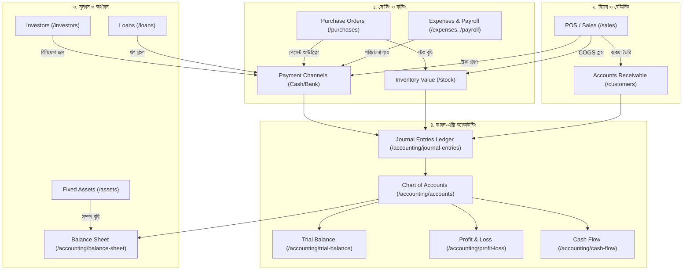

# 📚 OmniManage ERP — Costing, Investment & Accounting কমপ্লিট গাইড

এই ডকুমেন্টে **OmniManage ERP** সিস্টেমের সমস্ত **কস্টিং (Costing)**, **ইনভেস্টমেন্ট ও লোন (Investment & Financing)** এবং **ফাইন্যান্সিয়াল একাউন্টিং (Accounting & Reports)** পেজগুলোর বিস্তারিত বিবরণ, উদ্দেশ্য, কাজের পরিধি এবং গাণিতিক হিসাব-নিকাশের নিয়ম তুলে ধরা হলো।

---

## 📑 সূচিপত্র
1. [কস্টিং ও পারচেজ মডিউল (Costing & Purchase Pages)](#১-কস্টিং-ও-পারচেজ-মডিউল-costing--purchases)
2. [ইনভেস্টমেন্ট, লোন ও ফিক্সড অ্যাসেট (Investment & Financing Pages)](#২-ইনভেস্টমেন্ট-লোন-ও-অ্যাসেট-investment--financing)
3. [ফাইন্যান্স ও ডাবল-এন্ট্রি একাউন্টিং (Accounting & Ledger Pages)](#৩-ফাইন্যান্স-ও-ডাবল-এন্ট্রি-একাউন্টিং-accounting--ledger)
4. [আর্থিক বিবরণী ও রিপোর্টসমূহ (Financial Statements & Reports)](#৪-আর্থিক-বিবরণী-ও-রিপোর্টসমূহ-financial-reports)
5. [পেজগুলোর পারস্পরিক ইন্টারকানেকশন চার্ট](#৫-সিস্টেমের-ইন্টারকানেকশন-ফ্লোচার্ট)

---

## ১. কস্টিং ও পারচেজ মডিউল (Costing & Purchases)

### ১.১ Purchase Orders (`/purchases`)
- **উদ্দেশ্য:** নতুন প্রোডাক্ট ও গ্যাজেট সাপ্লায়ারদের কাছ থেকে কেনা এবং শপের স্টক বাড়ানো।
- **কী কী কাজ করা যায়:**
  - নতুন পারচেজ অর্ডার তৈরি (Vendor, Buying/Cost Price, Quantity, Tax, Shipping Cost)।
  - স্প্লিট পেমেন্ট (Cash, Bank, bKash, Due/Credit)।
  - পারচেজ রিসিভ করার সাথে সাথে স্বয়ংক্রিয়ভাবে ইনভেন্টরি স্টক বৃদ্ধি এবং অ্যাকাউন্টিং জার্নাল পোস্টিং।
- **কস্টিং সূত্র:**
  $$\text{Net Purchase Cost} = (\text{Unit Cost} \times \text{Qty}) + \text{Tax} + \text{Shipping} - \text{Discount}$$
  - **জার্নাল এন্ট্রি:** `Debit: Inventory (1030)` $\rightarrow$ `Credit: Bank/Cash/bKash (10xx)` অথবা `Accounts Payable (2000)`।

---

### ১.২ Product Catalog & Costing (`/products`)
- **উদ্দেশ্য:** প্রতিটি গ্যাজেটের কেনা দাম (Cost Price), বিক্রয় মূল্য (Selling Price) এবং লাভ নির্ধারণ।
- **কী কী কাজ করা যায়:**
  - প্রোডাক্টের ক্রয়মূল্য (`cost_price`) ও বিক্রয়মূল্য (`selling_price`) সেট করা।
  - প্রফিট মার্জিন শতাংশ দেখা।
  - ভ্যাট/ট্যাক্স রেট যুক্ত করা।
- **মার্জিন সূত্র:**
  $$\text{Gross Margin (\%)} = \left(\frac{\text{Selling Price} - \text{Cost Price}}{\text{Selling Price}}\right) \times 100$$

---

### ১.৩ Stock Overview & Inventory Valuation (`/stock`)
- **উদ্দেশ্য:** গোডাউন ও শপের বর্তমান স্টকের মোট আর্থিক মূল্য (Inventory Asset Worth) পর্যবেক্ষণ।
- **কী কী কাজ করা যায়:**
  - প্রতিটি আইটেমের বর্তমান স্টক কোয়ান্টিটি দেখা।
  - কম স্টক (Low Stock Alerts) নোটিফিকেশন।
  - স্টকের মোট ক্রয়মূল্য বা অ্যাসেট ভ্যালু হিসেব।
- **ইনভেন্টরি ভ্যালুয়েশন সূত্র:**
  $$\text{Total Inventory Asset} = \sum (\text{Available Qty} \times \text{Unit Cost Price})$$

---

### ১.৪ IMEI Tracker & Unit Costing (`/imei`)
- **উদ্দেশ্য:** প্রতিটি ইউনিক স্মার্টফোন/ডিভাইসের নির্দিষ্ট IMEI অনুযায়ী কেনা দাম ও বিক্রির হিসাব রাখা।
- **কী কী কাজ করা যায়:**
  - প্রতিটি IMEI-এর একক ক্রয়মূল্য ও পারচেজ চালান ট্র্যাকিং।
  - কোনো ডিভাইস বিক্রি হলে বা রিপেয়ারে গেলে তার নির্দিষ্ট হিস্ট্রি বের করা।

---

### ১.৫ Expenses & Operational Costs (`/expenses`)
- **উদ্দেশ্য:** শপের দৈনন্দিন পরিচালনা খরচ (দোকান ভাড়া, চা-নাস্তা, বিল, প্যাকেজিং ইত্যাদি) এন্ট্রি করা।
- **কী কী কাজ করা যায়:**
  - ক্যাটাগরিভিত্তিক খরচ রেকর্ড করা (Rent, Utilities, Marketing, Entertainment)।
  - খরচ কোন পেমেন্ট চ্যানেল (Cash, Bank, bKash) থেকে গেল তা ট্র্যাক করা।
  - ভাউচার ও রসিদ আপলোড করা।
  - **জার্নাল এন্ট্রি:** `Debit: Operating Expense (6000)` $\rightarrow$ `Credit: Payment Channel (10xx)`।

---

### ১.৬ Recurring Expenses (`/recurring-expenses`)
- **উদ্দেশ্য:** প্রতি মাসে নির্দিষ্ট সময়ে হওয়া নিয়মিত খরচগুলো (যেমন: শপ ভাড়া, ওয়াইফাই বিল, সফটওয়্যার সাবস্ক্রিপশন) অটোমেট করা।
- **কী কী কাজ করা যায়:**
  - মাসিক/সাপ্তাহিক রিকারিং রুল সেট করা।
  - নির্দিষ্ট তারিখে স্বয়ংক্রিয় এক্সপেন্স হিসেবে যুক্ত হওয়া।

---

### ১.৭ Payroll & Salary Costing (`/payroll`)
- **উদ্দেশ্য:** কর্মচারীদের মাসিক বেতন, বোনাস, কমিশন ও কর্তন হিসেব করে মোট স্টাফ খরচ বের করা।
- **কী কী কাজ করা যায়:**
  - বেসিক স্যালারি + অ্যালাউন্স - ডিডাকশন হিসেব।
  - স্যালারি শিট তৈরি ও এক ক্লিকে পেমেন্ট ডিসবার্স করা।
  - পে-রোল কস্ট প্রফিট অ্যান্ড লস স্টেটমেন্টে সরাসরি অপারেটিং এক্সপেন্স হিসেবে যোগ হয়।

---

### ১.৮ Repairs & Service Costing (`/repairs`)
- **উদ্দেশ্য:** কাস্টমারের ডিভাইস সার্ভিসিং ও যন্ত্রাংশের খরচ (Parts Cost) এবং সার্ভিস চার্জের লাভ বের করা।
- **কস্টিং সূত্র:**
  $$\text{Repair Net Profit} = \text{Customer Charge} - \text{Replaced Parts Cost}$$

---

## ২. ইনভেস্টমেন্ট, লোন ও অ্যাসেট (Investment & Financing)

### ২.১ Investor Management (`/investors`)
- **উদ্দেশ্য:** শপে যারা ক্যাপিটাল ইনভেস্ট করেছে (শেয়ারহোল্ডার/পার্টনার) তাদের বিনিয়োগ ও লভ্যাংশ বণ্টন পরিচালনা।
- **কী কী কাজ করা যায়:**
  - ইনভেস্টর প্রোফাইল ও মোট মূলধন (Deposits) রেকর্ড করা।
  - ইকুইটি শেয়ারের শতাংশ (%) নির্ধারণ।
  - লাভ হলে ইনভেস্টরদের মধ্যে স্বয়ংক্রিয় প্রফিট ডিস্ট্রিবিউশন (Profit Share) অথবা পুনঃবিনিয়োগ (Re-investment)।
  - উত্তোলন (Withdrawals) ট্র্যাক করা।

---

### ২.২ Loan Management (`/loans`)
- **উদ্দেশ্য:** ব্যাংক বা ব্যক্তি থেকে নেওয়া ঋণ (Loan Taken) এবং কাউকে দেওয়া ঋণ (Loan Given) ম্যানেজ করা।
- **কী কী কাজ করা যায়:**
  - ঋণের পরিমাণ, সুদের হার (Interest Rate) ও মেয়াদ সেট করা।
  - মাসিক কিস্তি (EMI) ক্যালকুলেশন ও পেমেন্ট রিমাইন্ডার ক্রন জব।
  - ঋণের আসল টাকা পরিশোধ এবং ইন্টারেস্ট খরচ আলাদা লেজারে পোস্টিং।

---

### ২.৩ Fixed Assets Management (`/assets`)
- **উদ্দেশ্য:** শপের স্থায়ী সম্পদ (যেমন: গ্লাস কাউন্টার, ডেকোরেশন, এসি, সিসিটিভি ক্যামেরা, কম্পিউটার) তালিকাভুক্ত ও ট্র্যাক করা।
- **কী কী কাজ করা যায়:**
  - অ্যাসেটের কেনা দাম ও ওয়ারেন্টি তথ্য রাখা।
  - ফিক্সড অ্যাসেট ব্যালেন্স শীটের Asset সাইডে যুক্ত হয় এবং ওনার্স ক্যাপিটালের সাথে সমন্বয় হয়।

---

## ৩. ফাইন্যান্স ও ডাবল-এন্ট্রি একাউন্টিং (Accounting & Ledger)

### ৩.১ Chart of Accounts (`/accounting/accounts`)
- **উদ্দেশ্য:** শপের সমস্ত আর্থিক লেজার অ্যাকাউন্টের সেন্ট্রাল ডিরেক্টরি।
- **প্রধান ৫টি অ্যাকাউন্ট ক্যাটাগরি:**
  1. **ASSET (1000-1999):** ক্যাশ, ব্যাংক, বিকাশ, নগদ, রকেট, ইনভেন্টরি, ফিক্সড অ্যাসেট।
  2. **LIABILITY (2000-2999):** সাপ্লায়ারের বকেয়া (Accounts Payable), ব্যাংক লোন।
  3. **EQUITY (3000-3999):** মালিকের মূলধন (Owner's Capital), ইনভেস্টর ক্যাপিটাল।
  4. **REVENUE (4000-4999):** পণ্য বিক্রয় আয় (Sales Revenue), সার্ভিস চার্জ আয়।
  5. **EXPENSE (5000-6999):** পণ্যের ক্রয় খরচ (COGS), দোকান পরিচালনা ব্যয় (Operating Expenses)।
- **স্পেশাল ফিচার:** প্রতিটি পেমেন্ট চ্যানেল কার্ড থেকে সরাসরি **ON / PAUSED** টগল করার সুবিধা।

---

### ৩.২ Journal Entries Ledger (`/accounting/journal-entries`)
- **উদ্দেশ্য:** ডাবল-এন্ট্রি বুককিপিংয়ের মাস্টার লেজার, যেখানে প্রতিটি ডেবিট ও ক্রেডিটের অডিট ট্রেইল থাকে।
- **কী কী কাজ করা যায়:**
  - প্রতিটি সেলস, পারচেজ, রিটার্ন এবং খরচের স্বয়ংক্রিয় জার্নাল এন্ট্রি দেখা।
  - ম্যানুয়াল অ্যাডজাস্টমেন্ট জার্নাল ভাউচার তৈরি করা।
  - ভুল এন্ট্রি রিভার্স বা Void করার সুবিধা।
- **গোল্ডেন রুল:** $\sum \text{Debit} = \sum \text{Credit}$ (প্রতিটি এন্ট্রি শতভাগ ব্যালেন্সড হতে হবে)।

---

## ৪. আর্থিক বিবরণী ও রিপোর্টসমূহ (Financial Reports)

### ৪.১ Profit & Loss Statement / Income Statement (`/accounting/profit-loss`)
- **উদ্দেশ্য:** নির্দিষ্ট সময়ে শপ লাভ নাকি লসে চলছে তার পূর্ণাঙ্গ আর্থিক বিবরণী।
- **হিসাবের ক্রম:**
  1. **Gross Revenue** = পণ্যের মোট বিক্রয় মূল্য - ডিসকাউন্ট - রিটার্ন
  2. **Cost of Goods Sold (COGS)** = যে প্রোডাক্টগুলো বিক্রি হয়েছে সেগুলোর মোট কেনা দাম
  3. **Gross Profit** = Gross Revenue - COGS
  4. **Operating Expenses** = দোকান ভাড়া + বিদ্যুৎ বিল + স্টাফ বেতন + অন্যান্য খরচ
  5. **Net Income (Net Profit)** = Gross Profit - Operating Expenses

---

### ৪.২ Balance Sheet (`/accounting/balance-sheet`)
- **উদ্দেশ্য:** নির্দিষ্ট দিনে শপের মোট আর্থিক স্থিতি (কী সম্পদ আছে এবং কার কাছে কত দেনা আছে)।
- **অ্যাকাউন্টিং সমীকরণ:**
  $$\text{Total Assets} = \text{Total Liabilities} + \text{Total Equity} + \text{Retained Earnings (Net Profit)}$$
  - **Assets:** Cash + Bank + Wallets + Inventory Stock + Receivables + Fixed Assets
  - **Liabilities:** Supplier Payables + Outstanding Loans
  - **Equity:** Owner's Investment + Investor Capital + Retained Earnings

---

### ৪.৩ Trial Balance (`/accounting/trial-balance`)
- **উদ্দেশ্য:** সকল লেজারের ডেবিট এবং ক্রেডিট সাইডের যোগফল সমান কি না তা পরীক্ষা করা।
- **বৈশিষ্ট্য:** যদি ডেবিট = ক্রেডিট মিলে যায়, তবে নিশ্চিত হওয়া যায় যে অ্যাকাউন্টিং বইতে কোনো গাণিতিক ভুল নেই।

---

### ৪.৪ Cash Flow Statement (`/accounting/cash-flow`)
- **উদ্দেশ্য:** শপে কোথা থেকে নগদ টাকা এলো এবং কোথায় নগদ টাকা খরচ হলো তার তিন স্তরের বিবরণী।
  1. **Operating Cash Flow:** সেলস থেকে ক্যাশ ইন, বকেয়া আদায় বনাম সাপ্লায়ার পেমেন্ট ও দোকান খরচ।
  2. **Investing Cash Flow:** নতুন শপ আসবাবপত্র বা যন্ত্রপাতি কেনা।
  3. **Financing Cash Flow:** নতুন ইনভেস্টর ডিপোজিট বা লোন গ্রহণ বনাম লোন পরিশোধ।

---

### ৪.৫ Business Analytics & Sales Trend (`/analytics`)
- **উদ্দেশ্য:** ভিজ্যুয়াল চার্ট ও গ্রাফের মাধ্যমে প্রফিট মার্জিন, টপ সেলিং প্রোডাক্ট, কাস্টমার রিটার্ন রেট এবং রেভিনিউ প্রবৃদ্ধি বিশ্লেষণ।

---

## ৫. সিস্টেমের ইন্টারকানেকশন ফ্লোচার্ট

---

## 💡 সংক্ষিপ্ত সারসংক্ষেপ

| কাজের ধরন | কোন পেজ ব্যবহার করবেন? | প্রধান কাজ |
| :--- | :--- | :--- |
| **নতুন মাল কেনা ও খরচ** | `/purchases`, `/expenses`, `/payroll` | কেনা দাম এন্ট্রি, স্টক বৃদ্ধি ও বিল পরিশোধ |
| **লাভ-লোকসান দেখা** | `/accounting/profit-loss` | মোট বিক্রি, COGS বাদ দিয়ে খাঁটি লাভ বের করা |
| **শপের মোট সম্পদ ও দেনা** | `/accounting/balance-sheet` | ক্যাশ + ইনভেন্টরি বনাম সাপ্লায়ার দেনা ও মূলধন |
| **পেমেন্ট চ্যানেল ও ব্যালেন্স** | `/accounting/accounts` | ক্যাশ, ব্যাংক, বিকাশ ব্যালেন্স ও অন/অফ টগল |
| **নগদ টাকার প্রবাহ** | `/accounting/cash-flow` | টাকা কোথায় এলো ও কোথায় বের হলো |
| **পার্টনার বা ইনভেস্টর** | `/investors`, `/loans` | লাভ বণ্টন, ঋণ ও মূলধন পরিচালনা |

---
*OmniManage ERP Suite — Built with Precision for Modern Multi-Tenant Gadget Stores.*
