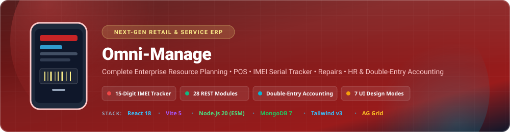

<div align="center">



[](https://react.dev)
[](https://nodejs.org)
[](https://mongodb.com)
[](https://tailwindcss.com)
[](https://vitejs.dev)
[](LICENSE)

</div>

---

## 🚀 Overview

**Omni-Manage** is a full-stack, enterprise-grade Resource Planning and Point-of-Sale (POS) system engineered specifically for mobile phone & gadget retailers, device service repair shops, and electronics wholesalers.

Unlike generic retail software, Omni-Manage manages **individual 15-digit serial numbers (IMEI tracking)** throughout every operational stage: purchase intake, multi-branch stock allocation, retail checkout, wholesale distribution, warranty claim processing, and technician repair job sheets.

> 📄 **Complete System Documentation & PRD:** Access full offline specifications, architecture diagrams, and end-to-end API guides in the [`docs/`](docs/) directory or review **[PRODUCT_REQUIREMENT_DOCUMENT.md](docs/PRODUCT_REQUIREMENT_DOCUMENT.md)** and **[PROJECT-SPEC.md](docs/PROJECT-SPEC.md)**.

---

## 📚 Documentation Hub (`docs/`)

All architecture, product requirement documents, system guides, and presentation decks are organized in the [`docs/`](docs/) directory:

| Document | Description | Direct Links |
|----------|-------------|--------------|
| 📄 **Product Requirement Document (PRD)** | Complete 28-module PRD, RBAC permissions, Mongoose schemas, NFRs | [PDF](docs/PRODUCT_REQUIREMENT_DOCUMENT.pdf) \| [Markdown](docs/PRODUCT_REQUIREMENT_DOCUMENT.md) \| [HTML](docs/PRODUCT_REQUIREMENT_DOCUMENT.html) |
| 📘 **Complete System Guide** | End-to-end user manual, API endpoint specs, module walkthrough | [PDF](docs/MOBILE_SHOP_ERP_SYSTEM_GUIDE.pdf) \| [HTML](docs/MOBILE_SHOP_ERP_SYSTEM_GUIDE.html) |
| 🏗️ **System Architecture** | Technical architectural diagrams & system component specifications | [HTML](docs/SYSTEM-ARCHITECTURE.html) |
| 📑 **Full Project Specification** | Phase-by-phase development plan & engineering decision matrix | [Markdown](docs/PROJECT-SPEC.md) |
| 📊 **Interactive Deck** | Executive presentation slides & visual platform overview | [HTML](docs/PRESENTATION.html) |

---

## ✨ Key System Features & Highlights

### 📱 POS & Rapid Checkout
- **Barcode & IMEI Scanner:** Instant lookup for products and 15-digit IMEI serial numbers.
- **Multi-Payment Split:** Supports Cash, Card, Mobile Financial Services (bKash/Nagad), and Customer Credit/Due.
- **Thermal Receipt Printing:** Instant 80mm/58mm thermal receipt rendering and client-side PDF invoice generation.
- **Sales Return & Restocking:** Restocking fee computation, IMEI status restoration, and customer credit notes.

### 📱 IMEI Serial Lifecycle Passport
- **Unique Serial Control:** Mandatory 15-digit IMEI validation upon stock receipt.
- **Strict State Machine:** `IN_STOCK` &rarr; `SOLD` &rarr; `IN_REPAIR` &rarr; `RETURNED` &rarr; `SCRAPPED`.
- **Complete Timeline Audit:** Instant history tracking from vendor purchase invoice to retail customer POS sale and repair tickets.
- **Bulk Excel Intake:** High-speed CSV/Excel importer with duplicate checksum detection.

### 🛠️ Device Repair & Job Sheet System
- **Digital Repair Tickets:** Captures physical flaws, passcode/pattern, problem description, and diagnostic notes.
- **Status Workflow:** `Received` &rarr; `Diagnosing` &rarr; `In Progress` &rarr; `Repaired` &rarr; `Delivered`.
- **Repair Billing:** Spare parts consumption from stock and technician labor fees posted directly to accounting revenue ledgers.

### 💰 Double-Entry Financial Accounting
- **Chart of Accounts:** Hierarchical Asset, Liability, Equity, Revenue, and Expense accounts.
- **Automated Postings:** POS sales, purchases, repair bills, expenses, and payroll runs automatically generate general ledger journal entries.
- **Financial Statements:** Live General Ledger, Trial Balance, Profit & Loss (P&L), and Balance Sheet generation.

### 👥 HR, Attendance & Payroll
- **Staff Directory:** Role-based profile management with base salary specifications.
- **Attendance & Overtime:** Check-in/out tracking with automatic overtime and late penalty computation.
- **Multi-Tier Leave Approvals:** Employee submission &rarr; Manager review &rarr; HR approval flow.
- **Itemized Pay Slips:** Automated monthly payroll calculation with printable pay slips.

### 🏢 Multi-Branch Inventory Governance
- **Branch Stock Isolation:** Location-specific inventory control across multiple retail outlets.
- **Inter-Branch Transfer Orders:** Transfer request, dispatch confirmation, in-transit state, and receiving verification.
- **Low Stock Push Alerts:** Real-time push notifications when inventory drops below safety thresholds.

---

## 🎨 7 Dynamic UI Design Themes

The frontend features 7 customizable design modes powered by Zustand (`client/src/store/themeStore.js`) allowing users to switch themes live without reloading:

| Theme Mode | Visual Characteristic |
|------------|-----------------------|
| **Flat** | Minimal corporate UI with crisp borders and clean contrast |
| **Neumorphism** | Soft extruded tactile 3D surfaces with inset/outset drop shadows |
| **Glassmorphism** | Translucent backdrop blur (`backdrop-filter: blur(12px)`) with frosted glass borders |
| **Liquid Glass** | Fluid gradient backdrop overlays with semi-transparent containers |
| **Neo Brutalism** | High-contrast 3px solid black borders, retro offset shadows, bold retro colors |
| **Aurora** | Dynamic glowing background mesh gradients with vibrant glowing accents |
| **Glassmorphism Pro** | Premium frosted glass hierarchy with high-contrast readable typography |

---

## ⚡ System Access & Default Credentials

| Component | Endpoint / URL | Details |
|-----------|----------------|---------|
| **Client Frontend Application** | `http://localhost:3000` | React 18 + Vite 5 Dashboard |
| **Backend REST API** | `http://localhost:5000/api/v1` | Node.js 20 + Express 4 ESM Server |
| **Interactive Swagger API Docs** | `http://localhost:5000/api-docs` | Live Swagger UI Documentation |
| **Database** | `mongodb://127.0.0.1:27017/omni_manage` | MongoDB 7 Connection |

### Seeded Credentials
- **Admin Username:** `admin` (Password set via `SEED_PASSWORD_ADMIN` in `server/.env`)
- **Manager Username:** `manager` (Password set via `SEED_PASSWORD_MANAGER` in `server/.env`)

---

## 🛠️ Complete REST API Modules (32 Modules)

All API endpoints are prefix-routed under `http://localhost:5000/api/v1`:

| Module | Route Prefix | Primary Description |
|--------|--------------|---------------------|
| **Auth** | `/auth` | Direct login (`/login-direct`), OTP verification, refresh token flow, TOTP 2FA |
| **User & Role** | `/users`, `/roles` | User account management, custom RBAC permissions matrix |
| **Catalog** | `/catalog` | Product categories, brands, models, and measurement units |
| **Product** | `/products` | Product master, SKUs, barcode generation, multi-tier pricing |
| **IMEI Tracker** | `/imei` | 15-digit serial tracking, status flow, IMEI history passport |
| **Stock** | `/stock` | Stock levels, low stock alerts, inter-branch transfer orders |
| **Supplier** | `/suppliers` | Supplier profiles, due balances, purchase history |
| **Purchase** | `/purchases` | Vendor purchase orders, incoming serial intake, AP posting |
| **Sale (POS)** | `/sales` | POS transactions, thermal receipts, PDF invoices, sales returns |
| **Wholesale** | `/wholesale` | Volume discount matrices, wholesale orders, credit checks |
| **Customer (CRM)** | `/customers` | Customer CRM history, receivables ledger, credit limits |
| **Warranty** | `/warranties` | Warranty registration, claim validation, replacement dispatch |
| **Repair** | `/repairs` | Device repair job sheets, technician assignments, parts billing |
| **Accounting** | `/accounting` | Double-entry journal entries, ledger, P&L, balance sheet |
| **Expense** | `/expenses` | Office expenses, petty cash, voucher attachments |
| **Investor** | `/investors` | Investor capital recording, equity ratios, profit distribution |
| **Loan** | `/loans` | Business loans, interest schedules, repayment logs |
| **Employee** | `/employees` | Staff directory, compensation structure, department specs |
| **Attendance** | `/attendance` | Daily check-in/out logging, overtime hours computation |
| **Leave** | `/leaves` | Employee leave requests, multi-tier approval workflow |
| **Payroll** | `/payroll` | Monthly salary slip calculation, printable pay slips |
| **Branch** | `/branches` | Multi-branch store configuration & stock allocations |
| **Document Vault** | `/documentVault` | Document uploads, categorizations, attachment previews |
| **Settings** | `/settings` | Store configuration, receipt headers/footers, design mode |
| **Notification** | `/notifications` | Live notification feeds, stock alerts, audit events |
| **SSE Stream** | `/sse` | Server-Sent Events stream for real-time push updates |
| **Audit Logs** | `/audit` | Immutable security audit trail capturing user IP, action, diffs |
| **Reports** | `/reports` | Analytics, profit margin reports, data exports |
| **Tenant** | `/tenants` | Multi-tenant shop registration, subscription & subdomain management |
| **Plans** | `/plans` | SaaS tier pricing plans & quota limits |
| **Contact** | `/contacts` | Public inquiry contact submissions |

---

## 💻 Local Quick Start Guide

### Prerequisites
- **Node.js**: v20+ LTS
- **MongoDB**: v7+ (running locally)
- **npm**: v10+

### 1. Backend Setup (Terminal 1)
```bash
cd server
npm install

# Copy environment configuration
cp .env.example .env

# Seed default roles, system settings & initial users
npm run seed

# Start backend dev server (Node --watch)
npm run dev
```
*Backend server runs at `http://localhost:5000`*

### 2. Frontend Setup (Terminal 2)
```bash
cd client
npm install

# Start Vite dev server
npm run dev
```
*Frontend client runs at `http://localhost:3000`*

---

## 🛡️ Security Policy & Compliance

- **Authentication:** Dual Bearer JWT token header and HTTP-Only cookies (`accessToken` & `refreshToken`).
- **Data Validation:** Zod runtime schemas on all incoming requests (`server/middleware/validate.middleware.js`).
- **File Validation:** Magic-byte file validation (`file-type` package) preventing MIME spoofing.
- **Auditability:** Immutable audit logging tracking user IDs, actions, IP addresses, and payload diffs.

---

## 📄 License

Licensed under the [AGPL v3 License](LICENSE).

<div align="center">


</div>
