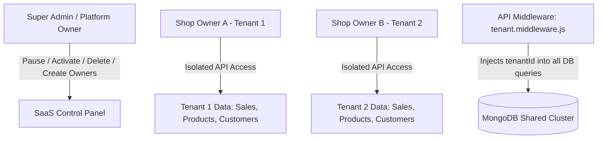

# Multi-Tenant SaaS Architecture Plan for Omni-Manage

Translating the current single-shop ERP into a scalable **Multi-Tenant SaaS (Software-as-a-Service) Platform** so you can sell and onboard multiple gadget & mobile shop owners seamlessly.

---

## 1. Architectural Strategy: Shared Database with Tenant Isolation

To ensure maximum performance and cost efficiency, we will implement a **Shared Database, Shared Schema** multi-tenancy model with strict data isolation.



---

## 2. Super Admin Tenant Control Specifications

### A. Account Lifecycle Actions
- **Activate Account**: Grant full operational access to a shop and its staff.
- **Pause / Suspend Account**: Temporarily lock a shop owner and all their staff from logging in (e.g. for overdue payments or policy violations).
- **Soft Delete Account**: Deactivate a shop account permanently while retaining historical financial and transaction logs for platform compliance.

### B. Manual Owner Onboarding & Mandatory OTP Validation
- **Manual Owner Creation**: Super Admin can manually create a new Shop Owner account directly from the SaaS Dashboard.
- **Mandatory Email OTP Validation**: No OTP bypass allowed. Every created shop owner account must undergo mandatory 6-digit email OTP verification before activation.
- **Support Impersonation ("Login as Tenant")**: Super Admin can securely view a tenant's workspace for troubleshooting upon request.

---

## 3. Proposed Changes

### Database Layer (`server/models/` & `server/modules/`)

#### [NEW] [tenant.model.js](file:///home/salahuddin/Mobile-Shop-ERP/server/modules/tenant/tenant.model.js)
- Stores tenant/shop accounts: `shopName`, `ownerName`, `email`, `phone`, `subdomain`, `plan` (Free, Starter, Pro, Enterprise), `status` (`ACTIVE`, `PAUSED`, `PENDING_VALIDATION`, `DELETED`), `expiresAt`, `maxBranches`, `maxUsers`.

#### [NEW] [subscription.model.js](file:///home/salahuddin/Mobile-Shop-ERP/server/modules/tenant/subscription.model.js)
- Manages pricing tiers, billing cycles, monthly/yearly payments, and feature limits.

#### [MODIFY] All Schema Models (`Product`, `Sale`, `Purchase`, `Expense`, `Customer`, `Supplier`, `Branch`, `IMEI`, `User`, `Role`, `Settings`)
- Inject mandatory `tenantId: { type: Schema.Types.ObjectId, ref: 'Tenant', required: true, index: true }` field across all database collections to enforce total data segregation.

---

### Backend API Middleware & Controllers (`server/modules/tenant/`)

#### [NEW] [tenant.middleware.js](file:///home/salahuddin/Mobile-Shop-ERP/server/middleware/tenant.middleware.js)
- Extracts `tenantId` from JWT token payload or custom domain header.
- Verifies that the tenant `status === 'ACTIVE'`; returns HTTP `403 Account Suspended` if the shop is paused.

#### [NEW] [tenant.controller.js](file:///home/salahuddin/Mobile-Shop-ERP/server/modules/tenant/tenant.controller.js)
- Endpoints for `createTenant`, `updateTenantStatus` (`pause`, `activate`, `delete`), `validateTenant`, `impersonateTenant`.

---

### Super Admin Control Panel (`client/src/pages/SaaS/`)

#### [NEW] [TenantManagement.jsx](file:///home/salahuddin/Mobile-Shop-ERP/client/src/pages/SaaS/TenantManagement.jsx)
- Master control page with 1-click **Pause Account**, **Activate Account**, **Enter OTP Code**, and **Create New Shop Owner** modal.

#### [NEW] [SubscriptionPlans.jsx](file:///home/salahuddin/Mobile-Shop-ERP/client/src/pages/SaaS/SubscriptionPlans.jsx)
- Configure SaaS subscription plans, branch limits, and user limits.

---

### Tenant Registration & Self-Onboarding (`client/src/pages/Auth/`)

#### [NEW] [RegisterShop.jsx](file:///home/salahuddin/Mobile-Shop-ERP/client/src/pages/Auth/RegisterShop.jsx)
- Public self-service signup page for mobile shop owners to register their shop, receive email OTP, and complete account activation.

---

## 4. Verification Plan

### Automated Build & Safety Checks
```bash
cd client && npm run check
cd server && npm test
```

### Manual Verification Flow
1. **Manual Owner Creation & Mandatory OTP**: Super Admin creates a shop owner directly, triggers email OTP dispatch, and verifies the 6-digit OTP code to activate the account.
2. **Pause & Resume Test**: Super Admin pauses Shop A. Verify that Shop A's users get an immediate "Account Suspended" screen upon login. Super Admin resumes Shop A; verify access is restored immediately.
3. **Data Isolation Test**: Log into Shop A and Shop B; verify zero data leakage.
